<div align="center">


# Instalación y configuración de Herramientas de Automatización
### - Reporte técnico en formado README.md
---
## Alumna: Brenda Hernández Negrete 1223100474

## Asignatura: Automatización de Infraestructura Digital I

## Docente: Eric Domenzain Morales

## Carrera: Ingenieria en Redes Inteligentes y Ciberseguridad

## Universidad Tecnológica del Norte de Guanajuato

### Fecha de entrega: 01/06/2026
---

</div>


# Indice
1. [**Introduccion**](#Introducción)
2. [**Desarrollo**](#Desarrollo)
3. [**Descripción de las herramientas utilizadas.**](#1-descripción-de-las-herramientas-utilizadas)
4. [***Docker Engine***](#docker-engine)
5. [***Caracteristicas de Docker Engine***](#caracteristicas-de-docker-engine)
6. [***Ventajas de Docker Engine***](#ventajas-de-docker-engine)
7. [**Docker Swagger**](#docker-swagger)
8. [***Caracteristicas de Docker Swagger***](#caracteristicas-de-docker-swagger)
9. [***Ventajas de Docker Swagger***](#ventajas-de-docker-swagger)
10. [***visual Studio Code***](#visual-studio-code)
11. [***Características de Visual Studio Code***](#características-de-visual-studio-code)
12. [***Ventajas de Visual Studio Code***](#ventajas-de-visual-studio-code)
13. [***GIT***](#git)
14. [***Caracteristicas de GIT***](#caracteristicas-de-git)
15. [***Ventajas de GIT***](#ventajas-de-git)
16. [**Procedimiento de instalación.**](#2-procedimiento-de-instalación)
17. [***Instalación de Visual Studio Code***](#instalación-de-visual-studio-code)
18. [***Pluggin de Docker***](#pluggin-de-docker)
19. [***Pluggin de YAML***](#pluggin-de-yaml)
20. [***Pluggin de GIT***](#pluggin-de-git)
21. [***Pluggin de Remote SSH***](#pluggin-de-remote-ssh)
22. [***Instalación de Docker Engine***](#instalación-de-docker-engine)
23. [***Instalación de Docker Compose***](#instalación-de-docker-compose)
24. [***Instalación de GIT***](#instalación-de-git)
25. [**Evidencias de funcionamiento**](#3-evidencias-de-funcionamiento)
26. [***Verificación de Docker***](#verificación-de-docker)
27. [***Verificacion de contenedores con archivo YAML***](#verificacion-de-contenedores-con-archivo-yaml)
29. [**Lista de Verificacion del Entorno**](#4-lista-de-verificación-del-entorno)
29. [**Conclusión**](#conclusión)
30. [**Bibliofrafía**](#bibliofrafía)

## Introducción

La automatización de redes representa una de las áreas más importantes dentro de la administración de infraestructura tecnológica, debido a que permite optimizar tareas repetitivas, reducir errores humanos y mejorar significativamente la eficiencia operativa de los sistemas informáticos. Actualmente, las organizaciones requieren implementar entornos escalables, seguros y rápidos de configurar, por lo que el uso de herramientas de automatización se ha convertido en una necesidad fundamental dentro de tecnologías de la información.

Dentro de este contexto, tecnologías como Docker, Docker compose, Git y Visual Studio Code permiten crear entornos de desarrollo estandarizados, portables y fáciles de administrar. Docker fácilita la virtualización ligera mediante contenedores, permitiendo ejecutar aplicaciones de manera aislada sin afectar el sistema operativo anfritión. Asimismo, Docker compose simplifica la administración de multiples contenedores contenedores utilizando archivos **`YAML`**,   mientras que Git permite mantener un control eficiente de versiones durante el desarrollo del proyecto.

El objetivo principal de esta práctica es instalar y configurar un entorno funcional de automatización de redes utilizando herramientas modernas de desarrollo y contenedores. Durante la práctica se realizaron instalaciónes en Ubuntu, configuraciones básicas, validaciones de funcionamiento y despliegues de contenedores utilizando Docker Compose.

Además, se verifico el correcto funcionamiento de cada herramienta mediante comandos de prueba y despliegue de servicios básicos. El uso de contenedores proporciona ventajas importantes como portabilidad, rapidez de implementación aislamiento de servicios y facilidad para replicar entornos completos de trabajo. Estas tecnologias representan actualmente una base escencial para el desarrollo de soluciones modernas orientadas a la automatización y administración eficiente de redes e infraestructura.

## Desarrollo 

### 1. Descripción de las herramientas utilizadas.

#### Docker Engine 

Docker Engine es una plataforma de virtualización basada en contenedores que permite crear, ejecutar y administrar aplicaciones de forma aislada dentro de un mismo sistema operativo. 

Se utiliza para desplegar aplicaciones en contenedores ligeros, facilitando la portabilidad y la compatibilidad entre diferentes entornos 

<p align="center">


##### Caracteristicas de Docker Engine 

- Virtualización ligera 
- Aislamiento de aplicaciones 
- Portabilidad murtiplataforma 
- Bajo consumo de recursos 
- Compatibilidad con microservicios 

##### Ventajas de Docker Engine 

- Simplificación en entornos complejos 
- Automatización de Infraestructura 
- Escalabilidad de servicios

#### Docker Swagger

Swagger es una herramienta orientada a la documentación y pruebas de APIs REST. Permite a los desarrolladores y organizaciones gestionar el ciclo de vida completo de una API. Swagger es una suite de herramientas que facilita la creación especificaciones OpenAPI, las cuales definen cómo se estructaran las API.

Se utiliza para diseñar, documentar y probar servicios web de manera interactiva.

<p align="center">


##### Caracteristicas de Docker Swagger 

- Interfaz grafica amigable 
- Documentación autómatica
- Compatibilidad con APIs REST 
- Integración con Docker

##### Ventajas de Docker Swagger

- Validación rapida de servicios 
- Pruenas automatizadas de APIs 
- Documentación centralizada 

#### Visual Studio Code 

Visual Studio Code es un editor de código fuente desarrollado por Microsoft.

Se utiliza para programación, edición de archivos de configuración y administración de proyectos. 

<p align="center">


##### Características de Visual Studio Code

- Interfaz gráfica 
- Soporte multiplataforma 
- Extenciones interadas 
- Terminal Incorporada 

##### Ventajas de Visual Studio Code 

- Facilita edición de archivos YAML 
- Integración con Docker y YAML 
- Compatibilidad con múltiples lenguajes

#### GIT

Git es un sistema de control de versiones distribuido.

Se utiliza para administrar cambios en proyectos de desarrollo

<p align="center">


##### Caracteristicas de GIT 

- Control de versiones
- Trabajo colaborativo 
- Historial de cambios 
- Integración con GitHub

##### Ventajas de GIT 

- Respaldo de configuraciones 
- Administración de Scripts 
- Control de cambios en infraestructura 

### 2. Procedimiento de instalación.

#### Instalación de Visual Studio Code

Como primera parte se ingresa al sitio web: https://code.visualstudio.com y se descarga la app, accedes a la carpeta donde se descargo y ahora si continuas con lo descrito en el archivo.

<p align="center">
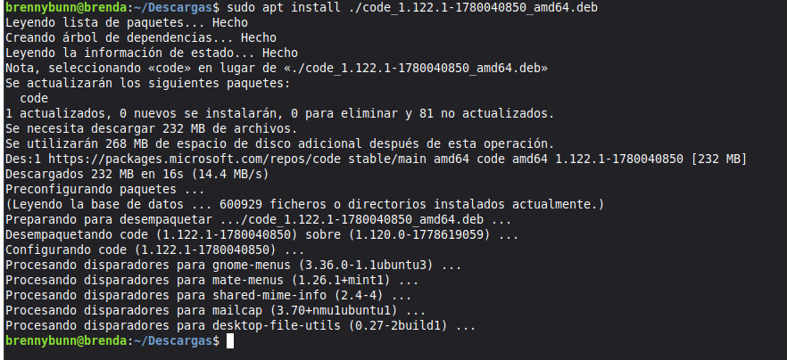

Para entrar a interfaz de Visual Studio Code, ejecuta el siguiente comando en terminal

```java
code
```

#### Pluggin de Docker

<p align="center">
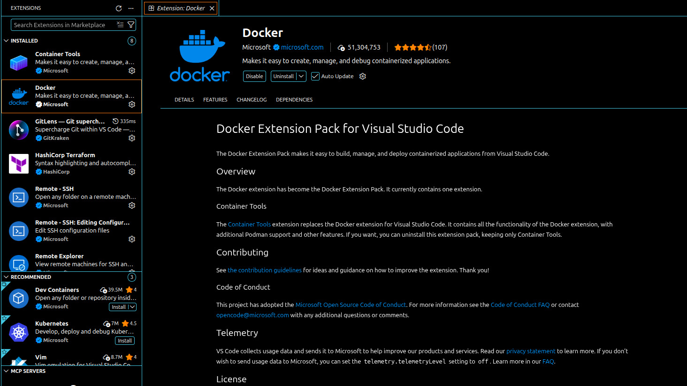

#### Pluggin de YAML

<p align="center">
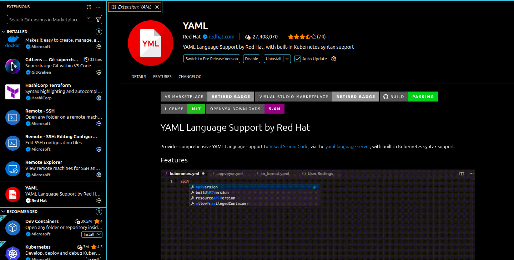

#### Pluggin de Git

<p align="center">
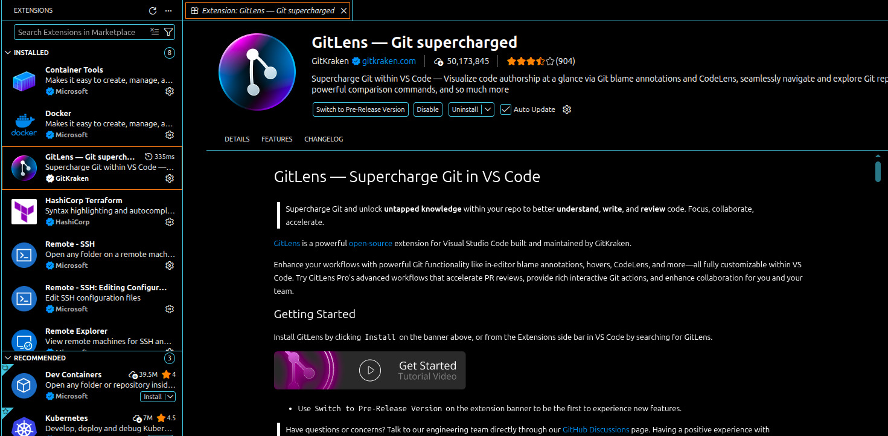

#### Pluggin de Remote SSH

<p align="center">
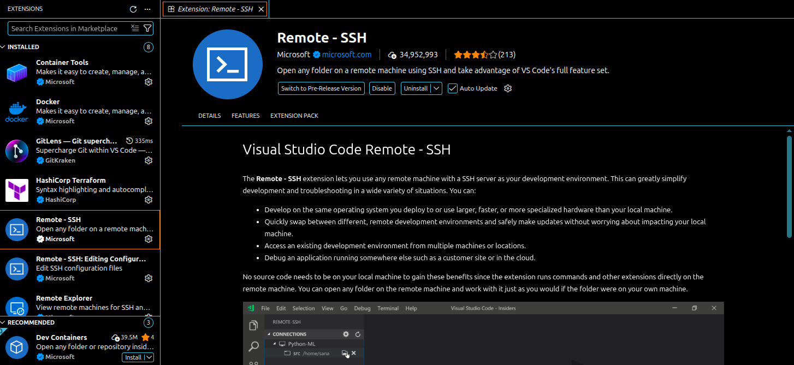

#### Instalación de Docker Engine

<p align="center">
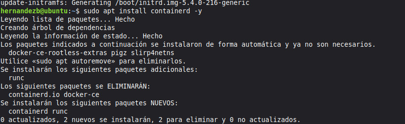
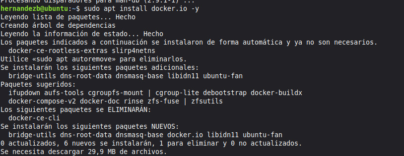

#### Instalación de Docker Compose

<p align="center">
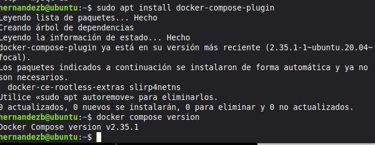

#### Instalación de GIT 

<p align="center">
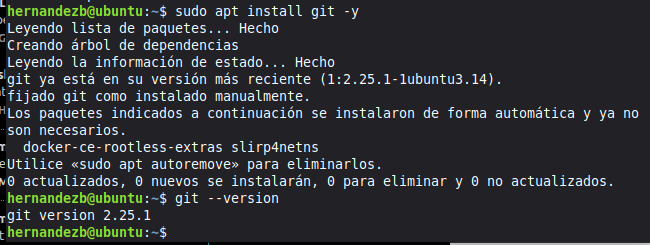

### 3. Evidencias de funcionamiento

#### Verificación de Docker 

Comando utilizado:

```java
docker run hello-worl 
```

<p align="center">
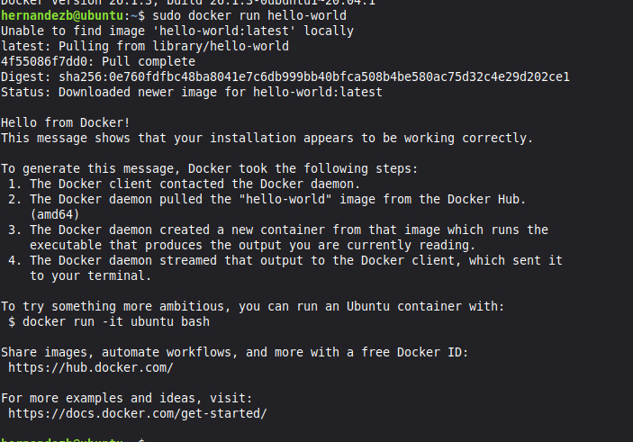

Este comando descarga automáticamente la imagen **`hello-world`** desde Docker Hub y ejecuta un contenedor de prueba.

Comando utilizado:

```java
docker ps 
```

<p align="center">
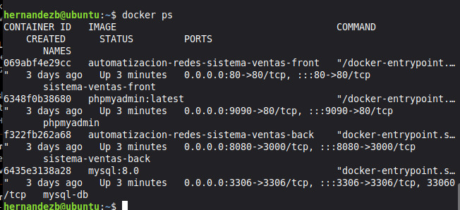

Este comando muestra la lista de contenedores que se muestran en ejecución.

#### Verificacion de contenedores con archivo YAML

Creas un  archivo con el siguiente comando:

```java
sudo nano docker-compose.yml
```
<p align="center">
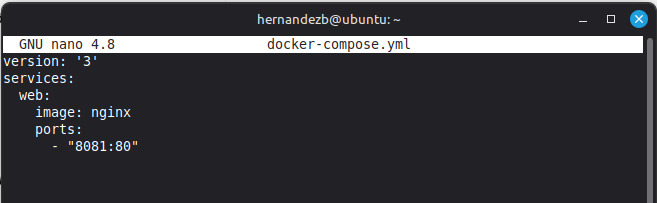

Ejecutas el archivo con el siguiente comando:
```java
docker compose -f docker-compose.yml up -d
```

<p align="center">
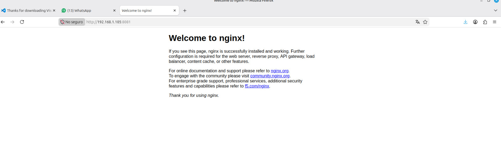

### 4. Lista de verificación del entorno

<table> 
<thead>
 <tr> 
  <th>Herramienta</th> 
  <th>Instalado</th> 
  <th>Verificado</th> <th>Observaciones</th>
   </tr> 
   </thead>
    <tbody>
     <tr> 
     <td>Visual Studio Code</td> <td>Sí</td>
      <td>Sí</td> 
      <td>Funcionamiento correcto</td> </tr>
       <tr>
        <td>Docker Engine</td>
         <td>Sí</td> 
         <td>Sí</td>
          <td>Motor activo</td>
           </tr>
            <tr>
             <td>Docker Compose</td> <td>Sí</td>
              <td>Sí</td> 
              <td>YAML funcional</td>
               </tr> 
               <tr>
                <td>Git</td>
                 <td>Sí</td> 
                 <td>Sí</td> <td>Configuración completada</td>
                  </tr>
                   <tr> 
                   <td>Contenedor hello-world</td> <td>Sí</td>
                    <td>Sí</td> <td>Ejecución exitosa</td>
                     </tr>
                      <tr> 
                      <td>Archivo YAML funcionando</td>
                       <td>Sí</td>
                        <td>Sí</td>
                         <td>Contenedor Nginx activo</td>
                          </tr>
                           </tbody> 
</table>

## Conclusión

Durante el desarrollo de esta práctica se logró instalar y configurar correctamente un entorno básico de automatización de redes utilizando herramientas modernas apmpliamente utilizadas en la industria tecnológica. La implementación de Docker Engine permitió comprender el funcionamiento de la virtualización basada en contenedores y la manera en que esta tecnología facilita la creación de entornos aislados, portables y eficientes para el despigue de aplicaciones y servicios.

Asimismo, la utilización de Docker Compose permitió automatizar el despliegue de contenedores mediante archivos YAML, simplificando considerablemente la administración de servicios múltiples dentro de un mismo entorno. De igual forma, el uso de Visual Studio Code facilitó la edición de y administración de archivos de configuración, mientras que Git proporciono mecanismos adecuados para el control de versiones y respaldo de cambios realizados durante el desarrollo de la práctica. 

La experiencia obtenida durante la configuración permitió identificar la importancia que tienen actualmente las herramientas de automatización dentro de la administración de redes e infraestructura tecnológica. Estas tecnológias no solamente reducen tiempo de implementación, sino que también permiten mejorar la estabilidad, escalabilidad y mantenimiento de los sistemas.

Finalmente, se concluye que el uso de contenedores representa una solución moderna y eficiente para el despliegue de aplicaciones y servicios, especialmente en entornos relacionados con automatización de redes, DevOps y administración de infraestructura. Los conocimientos adquiridos durante esta práctica fortalecen las competencias técnicas necesarias para enfrentar escenarios reales dentro del ámbito profesional de despliegue y automatización de recursos.


## Bibliofrafía 

Docker, Inc. (2025). *Docker Engine overview*. Docker Documentation. https://docs.docker.com/engine/

Docker, Inc. (2025). *Docker Engine version 29 release notes*. Docker Documentation. https://docs.docker.com/engine/release-notes/29/

Docker, Inc. (2025). *Docker Compose overview*. Docker Documentation. https://docs.docker.com/compose/

Docker, Inc. (2025). *Compose file reference*. Docker Documentation. https://docs.docker.com/reference/compose-file/

Docker, Inc. (2025). *Docker Compose quickstart*. Docker Documentation. https://docs.docker.com/compose/gettingstarted/

Docker, Inc. (2025). *Install Docker Engine on debian*. Docker Documentation. https://docs.docker.com/engine/install/debian/

Docker, Inc. (2026). *Docker Engine version 29: A foundation release*. Docker Blog. https://www.docker.com/blog/docker-engine-version-29/

SmartBear Software. (2025). *What is OpenAPI?* Swagger Documentation. https://swagger.io/docs/specification/v3_0/about/

SmartBear Software. (2025). *Swagger Editor documentation*. Swagger Documentation. https://swagger.io/docs/open-source-tools/swagger-editor/

SmartBear Software. (2025). *Swagger UI: REST API documentation tool*. Swagger. https://swagger.io/tools/swagger-ui/

Microsoft. (2025). *Visual Studio Code: Frequently asked questions*. Visual Studio Code Documentation. https://code.visualstudio.com/docs/supporting/FAQ

Git Project. (2024). *Git reference documentation*. Git SCM. https://git-scm.com/docs/git